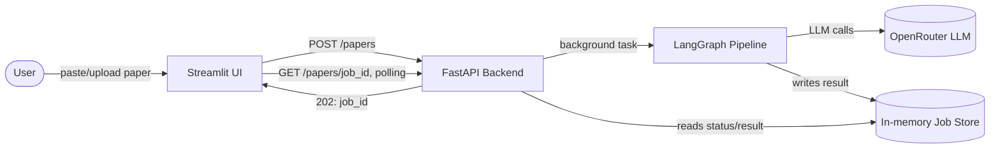
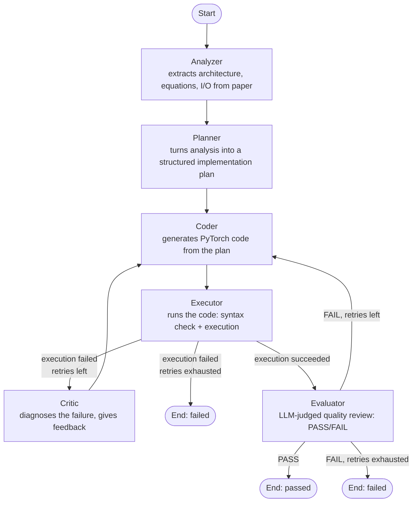

# PaperForge

Upload a research paper and get back a runnable PyTorch implementation — automatically analyzed, planned, coded, executed, critiqued, and evaluated by a multi-agent LangGraph pipeline.

## System Architecture



## Agent Pipeline (LangGraph)



Every agent shares one LLM client (`app/agents/llm.py`) and follows the same shape: build a prompt from the shared `AgentState`, call the LLM, return a partial state update.

## Tech Stack

- **Orchestration:** LangGraph (agent graph, retry loop, conditional routing)
- **LLM:** LangChain + OpenRouter (`openrouter/free`)
- **Backend API:** FastAPI (async job submission + polling)
- **Frontend:** Streamlit (paper upload/paste, live status polling, result viewer)
- **Containerization:** Docker + docker-compose (API + UI as separate services from one image)
- **CI/CD:** GitHub Actions (smoke tests + Docker image build on every push)

## Project Structure

```
paperforge/
├── app/
│   ├── agents/          # analyzer, planner, coder, executor, critic, evaluator, llm.py
│   ├── graph/            # state.py, workflow.py (LangGraph definition)
│   └── schemas.py         # Pydantic request/response models
├── api.py                 # FastAPI app
├── streamlit_app.py       # Streamlit UI
├── main.py                # CLI entry point (reads a paper from a file path)
├── tests/                 # smoke tests (no LLM calls; import + graph compile checks)
├── Dockerfile
├── docker-compose.yml
└── .github/workflows/ci.yml
```

## Running Locally

### Option 1: CLI
```bash
pip install -r requirements.txt
python main.py path/to/paper.txt
```

### Option 2: API + UI
```bash
pip install -r requirements.txt

# Terminal 1
uvicorn api:app --reload

# Terminal 2
streamlit run streamlit_app.py
```
Then open `http://localhost:8501`.

### Option 3: Docker Compose
```bash
docker compose up --build
```
API on `http://localhost:8000`, UI on `http://localhost:8501`.

## Configuration

Create a `.env` file in the project root:
```
OPENROUTER_API_KEY=your_key_here
```
No API keys are hardcoded anywhere in the codebase.

## Testing

```bash
python -m pytest tests/ -v
```
Smoke tests verify the graph compiles and all modules import correctly — they deliberately do not call the LLM, so they run without API credits and are safe to run in CI on every push.

## Roadmap

- Persistent job store (DB/Redis) and a real task queue (Celery/RQ) instead of in-process `BackgroundTasks`
- Cloud deployment
- PDF ingestion for direct paper upload
- Ground-truth benchmark comparison in the evaluator